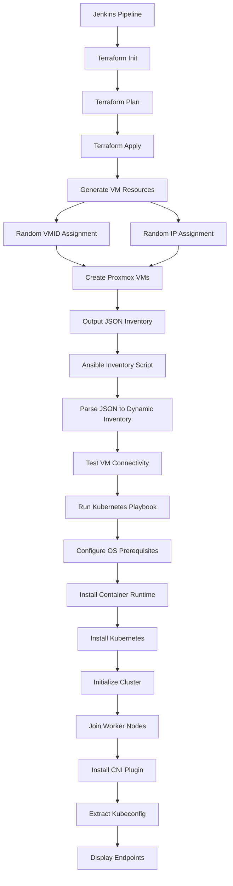

# Architecture Documentation

## System Flow Diagram



## Component Details

### Jenkins Pipeline Stages

1. **Checkout** - Clone repository from GitLab
2. **Terraform Init** - Initialize Terraform providers
3. **Terraform Plan** - Preview infrastructure changes
4. **Terraform Apply** - Create/update VMs
5. **Prepare Ansible** - Generate inventory, check VM readiness
6. **Deploy Kubernetes** - Run Ansible playbook
7. **Verify Cluster** - Test kubectl commands
8. **Extract Kubeconfig** - Save cluster credentials

### Terraform Components

#### Random Resource Generation
- `random_integer.vmid_base` - Base for sequential VMID assignment (100-899)
- `random_integer.ip_base` - Base for sequential IP assignment (10-240)
- `random_string.vm_suffix` - Unique suffix for VM names (12 chars)

#### VM Creation Logic
```
For each VM in CSV:
  if vmid == 0:
    vmid = vmid_base + index
  if ip == 0:
    ip = "10.200.0.{ip_base + index}"
  vm_name = "{original_name}-{random_suffix}"
```

### Ansible Playbook Structure

#### Play 1: Common Setup (all nodes)
- Disable swap
- Configure kernel modules
- Add Docker repository
- Install containerd
- Install Kubernetes packages

#### Play 2: HAProxy Setup (master nodes, HA only)
- Install HAProxy
- Configure load balancer for API server

#### Play 3: Initialize First Master
- Run kubeadm init
- Configure kubectl
- Generate join tokens

#### Play 4: Join Additional Masters (HA only)
- Join with control-plane certificate

#### Play 5: Join Worker Nodes
- Join workers to cluster

#### Play 6: Install CNI
- Deploy Flannel network plugin

#### Play 7: Verify Cluster
- Display cluster status

## Data Flow

### Terraform Output (JSON)
```json
{
  "all": {
    "vars": {
      "ansible_user": "root",
      "kubernetes_version": "1.28.0",
      "pod_network_cidr": "10.244.0.0/16"
    }
  },
  "k8s_masters": {
    "hosts": {
      "kube-master-xyz": {
        "ansible_host": "10.200.0.10"
      }
    }
  }
}
```

### Dynamic Inventory (Ansible Format)
```json
{
  "_meta": {
    "hostvars": {
      "kube-master-xyz": {
        "ansible_host": "10.200.0.10",
        "ansible_user": "root",
        "kubernetes_version": "1.28.0"
      }
    }
  },
  "k8s_masters": {
    "hosts": ["kube-master-xyz"]
  }
}
```

## Network Architecture

### Default Network Setup
- Management Network: 10.200.0.0/24
- Pod Network (Flannel): 10.244.0.0/16
- Service Network: 10.96.0.0/12

### Port Requirements
- SSH: 22 (Ansible management)
- Kubernetes API: 6443
- etcd: 2379-2380
- Kubelet: 10250
- NodePort Services: 30000-32767

## Security Model

### Authentication
- SSH key-based authentication for Ansible
- Proxmox API token authentication
- Kubernetes certificate-based auth

### Network Security
- Private network for cluster communication
- Firewall rules on Proxmox level
- Network policies in Kubernetes

## Scaling Considerations

### Horizontal Scaling
- Add entries to vms.csv
- Re-run pipeline
- Automatic join to existing cluster

### Multi-Master HA
- Set multiple masters in CSV
- Playbook auto-configures HAProxy
- Shared control plane endpoint

## Monitoring Integration Points

### Metrics Collection
- Node metrics via metrics-server
- Application metrics via Prometheus
- Log aggregation via Fluentd/Loki

### Health Checks
- Kubernetes component health
- Node readiness status
- Pod/Service availability