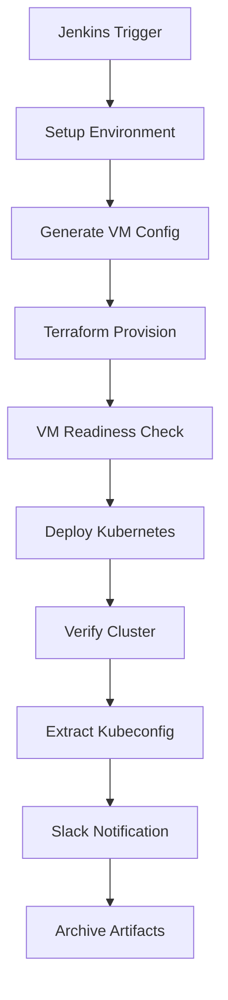

# Infrastructure as Code (IaC) Pipeline Documentation

## 📋 Table of Contents
1. [Overview](#overview)
2. [Architecture Flow](#architecture-flow)
3. [Terraform Files](#terraform-files)
4. [Ansible Files](#ansible-files)
5. [Pipeline Scripts](#pipeline-scripts)
6. [Jenkins Pipeline Flow](#jenkins-pipeline-flow)
7. [Complete Execution Flow](#complete-execution-flow)

---

## 📖 Overview

This Infrastructure as Code (IaC) pipeline automates the complete deployment of Kubernetes clusters on Proxmox infrastructure. It uses a combination of Terraform for infrastructure provisioning, Ansible for configuration management, and Jenkins for CI/CD orchestration.

### 🎯 What This Pipeline Does:
- **Provisions VMs** on Proxmox using Terraform
- **Configures Kubernetes** on those VMs using Ansible
- **Validates deployment** and extracts kubeconfig
- **Notifies team** via Slack with deployment details
- **Archives artifacts** for easy access

---

## 🏗️ Architecture Flow



---

## 🔧 Terraform Files

### `terraform/main.tf`
**Purpose**: Main Terraform configuration for VM provisioning

**Key Functions**:
1. **Provider Configuration**: Connects to Proxmox API
2. **Data Sources**: Reads VM specifications from CSV
3. **Resource Creation**: Creates VMs with specified configurations
4. **Networking**: Assigns IP addresses and network settings

**Why This Exists**: 
- Terraform provides declarative infrastructure management
- Ensures consistent VM creation across environments
- Supports scaling and modification of infrastructure
- Integrates with Proxmox's API for automated provisioning

**What It Provisions**:
- Virtual machines with specified CPU, memory, disk
- Network configurations with static IP assignments
- Template-based VM creation for consistency

### `terraform/variables.tf`
**Purpose**: Defines input variables for Terraform

**Key Variables**:
- `pm_api_url`: Proxmox API endpoint
- `pm_api_token_id`: Authentication token ID
- `pm_api_token_secret`: Authentication secret
- VM specifications (cores, memory, disk size)

**Why This Exists**:
- Separates configuration from code
- Enables environment-specific deployments
- Provides type validation and default values

### `terraform/outputs.tf`
**Purpose**: Defines outputs from Terraform execution

**Key Outputs**:
- `ansible_inventory_json`: Complete inventory for Ansible
- `assignment_summary`: VM assignment details
- `vm_assignments`: Individual VM configurations

**Why This Exists**:
- Passes infrastructure data to Ansible
- Provides deployment summary information
- Enables integration between Terraform and Ansible

### `terraform/vms.csv`
**Purpose**: VM specification input file

**Structure**:
```csv
vmid,vm_name,template,node,ip,cores,memory,disk_size
0,kube-master,t-debian12-86,thinkcentre,0,2,2048,32G
0,kube-worker01,t-debian12-86,thinkcentre,0,2,2048,32G
```

**Why This Exists**:
- Provides declarative VM specifications
- Easy to modify without changing Terraform code
- Supports different environments with different CSV files

---

## 🎭 Ansible Files

### `ansible/ansible.cfg`
**Purpose**: Ansible configuration file

**Key Settings**:
- `inventory = ../scripts/inventory.py`: Dynamic inventory script
- `strategy = mitogen_linear`: Ultra-fast execution strategy
- `forks = 50`: Parallel execution settings
- SSH optimizations for faster connections

**Why This Exists**:
- Optimizes Ansible performance with Mitogen
- Configures SSH settings for reliable connections
- Sets up dynamic inventory integration

### `ansible/playbooks/k8s-cluster-setup.yml`
**Purpose**: Main Kubernetes cluster setup playbook

**Key Tasks**:
1. **System Preparation**: Updates packages, installs dependencies
2. **Container Runtime**: Installs and configures containerd
3. **Kubernetes Installation**: Downloads and installs K8s components
4. **Cluster Initialization**: Initializes master node with kubeadm
5. **Network Plugin**: Installs CNI (Cilium/Flannel)
6. **Worker Joining**: Joins worker nodes to cluster
7. **Validation**: Verifies cluster health

**Why This Exists**:
- Automates complex Kubernetes setup process
- Ensures consistent configuration across environments
- Handles both single-node and multi-node clusters


---

## 🔨 Pipeline Scripts

### Setup and Environment Scripts

#### `scripts/setup_environment.sh`
**Purpose**: Prepares Python environment and dependencies

**Key Functions**:
1. Creates fresh Python virtual environment
2. Installs required packages (asyncssh, paramiko, mitogen, PyYAML)
3. Sets up Mitogen for ultra-fast Ansible performance
4. Configures caching for subsequent runs

**Why This Exists**:
- Ensures consistent Python environment
- Provides performance optimizations with Mitogen
- Isolates dependencies from system Python

### Terraform Scripts

#### `scripts/terraform_apply.sh`
**Purpose**: Executes Terraform infrastructure provisioning

**Key Functions**:
1. Runs `terraform apply` with parallel execution
2. Outputs deployment summary
3. Validates Terraform state
4. Generates Ansible inventory output

**Why This Exists**:
- Separates Terraform execution logic from Jenkins
- Provides consistent error handling
- Enables parallel VM provisioning for speed

### VM Management Scripts

#### `scripts/check_vm_readiness.sh`
**Purpose**: Verifies VMs are ready before Kubernetes deployment

**Key Functions**:
1. Validates Terraform inventory output
2. Waits for VMs to become SSH-accessible
3. Uses smart retry mechanism with exponential backoff
4. Validates JSON inventory structure

**Why This Exists**:
- Prevents deployment failures due to unready VMs
- Provides robust retry logic for reliability
- Validates data pipeline between Terraform and Ansible

#### `scripts/smart_vm_ready.py`
**Purpose**: Advanced VM readiness checking with parallel execution

**Key Features**:
1. **Parallel SSH Testing**: Tests multiple VMs simultaneously
2. **Batch Processing**: Processes VMs in configurable batches
3. **Comprehensive Checks**: Tests SSH connectivity and basic system readiness
4. **Progress Reporting**: Real-time progress updates

**Why This Exists**:
- Dramatically reduces waiting time with parallel checks
- Provides detailed feedback on VM readiness status
- Handles large-scale deployments efficiently

### Kubernetes Deployment Scripts

#### `scripts/deploy_kubernetes.sh`
**Purpose**: Orchestrates Kubernetes cluster deployment

**Key Functions**:
1. Validates inventory contains hosts
2. Executes Kubernetes setup script
3. Handles both optimized and standard deployment paths
4. Provides deployment progress feedback

**Why This Exists**:
- Centralizes Kubernetes deployment logic
- Provides error handling and validation
- Supports different deployment strategies

#### `scripts/run-k8s-setup.sh`
**Purpose**: Main Kubernetes cluster setup orchestrator

**Key Functions**:
1. **Pre-flight Checks**: Validates environment and connectivity
2. **Playbook Execution**: Runs Ansible playbooks with optimizations
3. **Cluster Validation**: Verifies cluster health and node readiness
4. **Performance Monitoring**: Reports deployment timing

**Why This Exists**:
- Provides comprehensive Kubernetes setup workflow
- Handles complex playbook orchestration
- Ensures cluster is fully operational before completion

### Configuration Extraction Scripts

#### `scripts/extract_kubeconfig.sh`
**Purpose**: Extracts kubeconfig from deployed cluster

**Key Functions**:
1. Tests Ansible connectivity to master nodes
2. Attempts multiple kubeconfig extraction methods
3. Validates YAML structure of extracted config
4. Creates artifact copies for Jenkins archival

**Why This Exists**:
- Provides automated access credential extraction
- Supports multiple extraction methods for reliability
- Enables immediate cluster access after deployment

#### `scripts/get_kubeconfig.py` & `scripts/get_kubeconfig_v2.py`
**Purpose**: Python-based kubeconfig extraction utilities

**Key Features**:
- **Multiple Location Checking**: Tries different kubeconfig paths
- **Ansible Integration**: Uses Ansible modules for file retrieval
- **Error Handling**: Graceful fallbacks and error reporting
- **Content Validation**: Ensures extracted config is valid

**Why These Exist**:
- Provide programmatic kubeconfig extraction
- Handle edge cases in different Kubernetes distributions
- Offer multiple extraction strategies for reliability

#### `scripts/simple_get_kubeconfig.sh`
**Purpose**: Bash-based kubeconfig extraction fallback

**Key Functions**:
1. Direct Ansible shell commands for file access
2. JSON output parsing for clean extraction
3. Multiple method attempts (cat, kubectl config view)
4. Directory creation and file management

**Why This Exists**:
- Provides simple, reliable extraction method
- Serves as fallback when Python methods fail
- Uses minimal dependencies (bash, ansible)

### Inventory Management Scripts

#### `scripts/inventory.py`
**Purpose**: Dynamic Ansible inventory script

**Key Functions**:
1. Reads JSON inventory from Terraform output
2. Converts to Ansible dynamic inventory format
3. Provides host groupings (masters, workers)
4. Includes host variables and connection details

**Why This Exists**:
- Bridges Terraform outputs to Ansible inputs
- Provides dynamic inventory without static files
- Supports complex host grouping and variables

#### `scripts/count_inventory_hosts.py`
**Purpose**: Inventory validation and reporting utility

**Key Functions**:
1. Counts hosts in different groups
2. Validates inventory structure
3. Provides detailed inventory analysis
4. Supports debugging inventory issues

**Why This Exists**:
- Enables inventory validation in pipeline
- Provides debugging capabilities
- Supports deployment decision logic

#### `scripts/generate_simple_inventory.py`
**Purpose**: Fallback inventory generator

**Key Functions**:
1. Creates basic inventory when Terraform output unavailable
2. Provides emergency recovery capability
3. Generates minimal viable inventory structure

**Why This Exists**:
- Provides backup inventory generation
- Supports manual cluster operations
- Enables recovery from pipeline failures

### Notification Scripts

#### `scripts/notify_slack.sh`
**Purpose**: Slack notification orchestrator

**Key Functions**:
1. Extracts cluster information from Terraform
2. Calls Python message formatter
3. Sends formatted message to Slack webhook
4. Handles notification failures gracefully

**Why This Exists**:
- Provides team notification automation
- Integrates deployment status with communication tools
- Supports deployment workflow visibility

#### `scripts/format_slack_message.py`
**Purpose**: Professional Slack message formatter

**Key Features**:
1. **Rich Message Formatting**: Uses Slack Block Kit for professional appearance
2. **Dynamic Content**: Includes build info, cluster details, and access instructions
3. **Artifact Integration**: Provides direct links to kubeconfig downloads
4. **Error Handling**: Graceful handling of missing information

**Why This Exists**:
- Creates professional, informative deployment notifications
- Provides immediate access to cluster credentials
- Supports team collaboration and deployment tracking

#### `scripts/send_slack_fallback.py`
**Purpose**: Fallback Slack notification system

**Key Functions**:
1. Simple message sending when main formatter fails
2. Base64 encoding for large kubeconfig content
3. Multiple message strategy for size limitations
4. Robust error handling and retries

**Why This Exists**:
- Ensures notifications are always sent
- Handles Slack message size limitations
- Provides backup communication channel

### Mitogen Integration Scripts

#### `scripts/setup_mitogen.py`
**Purpose**: Mitogen plugin setup for Ansible acceleration

**Key Functions**:
1. Downloads and configures Mitogen
2. Sets up Ansible plugin structure
3. Configures performance optimizations

**Why This Exists**:
- Dramatically improves Ansible execution speed
- Reduces deployment time by 5-10x
- Provides reliable connection handling

#### `scripts/mitogen_ansible_cfg.py`
**Purpose**: Generates Mitogen-optimized Ansible configuration

**Key Functions**:
1. Creates Ansible configuration with Mitogen settings
2. Optimizes connection and execution parameters
3. Sets up performance monitoring

**Why This Exists**:
- Automates Mitogen configuration setup
- Ensures optimal performance settings
- Reduces manual configuration errors

### Utility Scripts

#### `scripts/get_first_master.py`
**Purpose**: Identifies primary master node from inventory

**Key Functions**:
1. Parses inventory JSON structure
2. Returns first master node identifier
3. Handles inventory format variations

**Why This Exists**:
- Provides consistent master node identification
- Supports single-master and multi-master clusters
- Enables targeted operations on primary node

#### `scripts/detect_os_type.py`
**Purpose**: Operating system detection utility

**Key Functions**:
1. Identifies OS distribution on target hosts
2. Supports deployment customization based on OS
3. Provides compatibility checking

**Why This Exists**:
- Enables OS-specific deployment logic
- Supports multiple Linux distributions
- Provides deployment compatibility validation

---

## 🔄 Jenkins Pipeline Flow

### Stage 1: Checkout
**Purpose**: Retrieves source code from Git repository
- Checks out latest code from main branch
- Ensures all scripts and configurations are available

### Stage 2: Setup Environment
**Purpose**: Prepares execution environment
- **Script**: `scripts/setup_environment.sh`
- Creates Python virtual environment
- Installs required dependencies
- Sets up Mitogen for Ansible acceleration

### Stage 3: Generate VM Configuration
**Purpose**: Prepares VM specifications
- Reads VM configuration from Jenkins parameters
- Writes configuration to `terraform/vms.csv`
- Validates configuration format

### Stage 4: Terraform Provisioning

#### Stage 4a: Init
**Purpose**: Initializes Terraform workspace
- Downloads required providers
- Initializes backend state
- Caches providers for performance

#### Stage 4b: Apply
**Purpose**: Provisions infrastructure
- **Script**: `scripts/terraform_apply.sh`
- Creates VMs on Proxmox
- Generates Ansible inventory
- Provides deployment summary

### Stage 5: VM Readiness
**Purpose**: Ensures VMs are ready for configuration
- **Script**: `scripts/check_vm_readiness.sh`
- **Utility**: `scripts/smart_vm_ready.py`
- Tests SSH connectivity to all VMs
- Validates system readiness
- Implements retry logic for reliability

### Stage 6: Deploy Kubernetes
**Purpose**: Configures Kubernetes cluster
- **Script**: `scripts/deploy_kubernetes.sh`
- **Main Script**: `scripts/run-k8s-setup.sh`
- **Playbook**: `ansible/playbooks/k8s-cluster-setup.yml`
- Installs Kubernetes components
- Initializes cluster
- Joins worker nodes
- Configures networking

### Stage 7: Verify Kubernetes Cluster
**Purpose**: Validates cluster deployment
- Tests kubectl connectivity
- Verifies node readiness
- Checks pod deployment status

### Stage 8: Extract & Notify
**Purpose**: Extracts credentials and notifies team
- **Script**: `scripts/extract_kubeconfig.sh`
- **Notification**: `scripts/notify_slack.sh`
- Extracts kubeconfig from master
- Validates configuration
- Sends Slack notification with cluster details

### Stage 9: Show Summary
**Purpose**: Displays deployment summary
- Shows Terraform outputs
- Provides infrastructure details
- Lists VM assignments

---

## 🔄 Complete Execution Flow

### 1. **Pipeline Trigger**
```
User triggers Jenkins job → Parameters validated → Checkout code
```

### 2. **Environment Setup**
```
setup_environment.sh:
├── Create Python venv
├── Install dependencies (asyncssh, paramiko, mitogen, PyYAML)
├── Setup Mitogen plugins
└── Configure Ansible optimization
```

### 3. **Infrastructure Provisioning**
```
Terraform Flow:
├── Read vms.csv configuration
├── Connect to Proxmox API
├── Create VMs based on specifications
├── Assign IP addresses
├── Generate ansible_inventory_json
└── Output deployment summary
```

### 4. **VM Readiness Validation**
```
check_vm_readiness.sh → smart_vm_ready.py:
├── Parse Terraform inventory output
├── Test SSH connectivity (parallel batches)
├── Validate system readiness
├── Retry failed connections
└── Report readiness status
```

### 5. **Kubernetes Deployment**
```
deploy_kubernetes.sh → run-k8s-setup.sh → k8s-cluster-setup.yml:
├── Validate inventory has hosts
├── Execute Ansible playbook
├── Install container runtime (containerd)
├── Install Kubernetes components
├── Initialize master node
├── Install CNI plugin (Cilium/Flannel)
├── Join worker nodes
└── Validate cluster health
```

### 6. **Credential Extraction**
```
extract_kubeconfig.sh:
├── Test ansible connectivity
├── Try simple_get_kubeconfig.sh
├── Fallback to get_kubeconfig_v2.py
├── Fallback to get_kubeconfig.py
├── Validate YAML structure
├── Copy to ansible/kubeconfig/
└── Archive for Jenkins
```

### 7. **Notification & Completion**
```
notify_slack.sh → format_slack_message.py:
├── Extract cluster suffix from Terraform
├── Format professional Slack message
├── Include kubeconfig download links
├── Send to Slack webhook
└── Archive artifacts (inventory, kubeconfig, CSV)
```

### 8. **Final Outputs**
- **Running Kubernetes Cluster**: Fully configured and validated
- **Kubeconfig Access**: Available via Jenkins artifacts
- **Team Notification**: Slack message with cluster details
- **Infrastructure Documentation**: Terraform state and outputs
- **Deployment Logs**: Complete pipeline execution history

---

## 🎯 Key Benefits of This Architecture

### **Performance**
- **Mitogen Integration**: 5-10x faster Ansible execution
- **Parallel Processing**: VM readiness checks and batch operations
- **Caching**: Terraform providers and Python environments

### **Reliability**
- **Multiple Fallbacks**: Multiple kubeconfig extraction methods
- **Retry Logic**: Robust error handling and recovery
- **Validation**: Comprehensive checks at each stage

### **Maintainability**
- **Modular Scripts**: Each function in separate, testable scripts
- **Clear Separation**: Infrastructure (Terraform) vs Configuration (Ansible)
- **Centralized Configuration**: All scripts in single directory

### **Observability**
- **Progress Reporting**: Real-time status updates
- **Slack Notifications**: Professional deployment notifications
- **Comprehensive Logging**: Detailed execution logs at each stage
- **Artifact Archival**: Easy access to deployment artifacts

This architecture provides a robust, scalable, and maintainable solution for automated Kubernetes cluster deployment on Proxmox infrastructure.